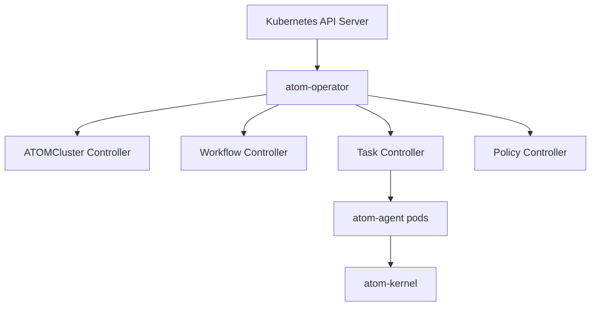

# atom-operator

> Kubernetes Operator для ATOMFederationOS v10 — управление кластерами, workflow и задачами через CRDs.

[](https://go.dev)
[](https://kubernetes.io)
[](LICENSE)

## Overview

**atom-operator** — официальный Kubernetes Operator, построенный на `controller-runtime`. Управляет жизненным циклом ATOMFederationOS через CRDs: `ATOMCluster`, `Workflow`, `Task`, `Policy`.

## Architecture



## CRD Reference

### ATOMCluster

```yaml
apiVersion: atom.atomesh.io/v1alpha1
kind: ATOMCluster
metadata:
  name: home-lab
  namespace: atom-system
spec:
  version: "10.0"
  clusterID: "home-lab-001"
  nodes:
    - nodeID: "node-1"
      host: "192.168.1.101"
      port: 9090
      role: ["executor", "quorum"]
    - nodeID: "node-2"
      host: "192.168.1.102"
      port: 9090
      role: ["executor", "quorum"]
    - nodeID: "node-3"
      host: "192.168.1.103"
      port: 9090
      role: ["executor"]
  deterministic:
    tickIntervalMs: 100
    quorumRatio: 0.67
    enableLockstep: true
```

### Workflow

```yaml
apiVersion: atom.atomesh.io/v1alpha1
kind: Workflow
metadata:
  name: yolo-training
  namespace: ml-team
spec:
  clusterRef:
    name: home-lab
    namespace: atom-system
  dag:
    nodes:
      - id: preprocess
        taskRef:
          kind: Task
          name: preprocess-data
        dependencies: []
      - id: train
        taskRef:
          kind: Task
          name: train-yolo
        dependencies: ["preprocess"]
      - id: validate
        taskRef:
          kind: Task
          name: validate-model
        dependencies: ["train"]
  execution:
    maxParallel: 2
    retryPolicy:
      maxAttempts: 3
      backoffMs: 2000
  deterministic:
    requiredTickSync: true
    replayable: true
```

### Task

```yaml
apiVersion: atom.atomesh.io/v1alpha1
kind: Task
metadata:
  name: preprocess-data
spec:
  binary:
    image: "ml-preprocess:v2.1"
    entrypoint: "/bin/preprocess"
  sandbox:
    cpuLimit: "2"
    memoryLimit: "4Gi"
    allowedSyscalls: [read, write, mmap, brk]
  checkpoint:
    enabled: true
    intervalTicks: 10
```

### Policy

```yaml
apiVersion: atom.atomesh.io/v1alpha1
kind: Policy
metadata:
  name: strict-sandbox
  namespace: atom-system
spec:
  enforcement: Enforce
  sbs:
    invariants:
      - name: no-split-brain
        expression: "len(active_leaders) <= 1"
        severity: Critical
      - name: quorum-maintained
        expression: "active_quorum >= required_quorum"
        severity: Critical
      - name: no-stale-reads
        expression: "stale_reads == 0"
        severity: Warning
    allowedSyscalls: [read, write, mmap, brk, clock_nanosleep]
    blockedSyscalls: [mount, syslog, ptrace, init_module]
    network:
      mode: isolated
```

## Quick Start

```bash
git clone https://github.com/mahaasur13-sys/atom-operator.git
cd atom-operator

make install   # install CRDs into cluster
make run       # run operator locally (for dev)
make deploy    # deploy into cluster

# Verify
kubectl get crds | grep atom.atomesh.io
```

## Project Layout

```
atom-operator/
├── api/v1alpha1/          # CRD type definitions
├── controllers/           # Reconciler implementations
│   ├── atomcluster_controller.go
│   ├── workflow_controller.go
│   ├── task_controller.go
│   └── policy_controller.go
├── pkg/
│   ├── sbs/              # SBS enforcement
│   └── reconciler/       # Shared reconciliation logic
├── config/crd/bases/     # CRD manifests
├── config/deploy/        # Deployment manifests
├── Makefile
└── go.mod
```

## License

MIT © mahaasur13-sys
